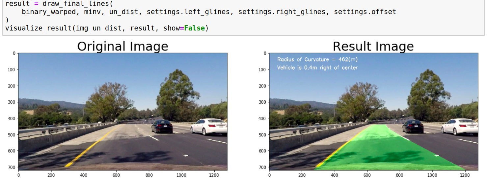

**Advanced Lane Finding Project**
---

### - The goals / steps of this project are the following:

* Compute the camera calibration matrix and distortion coefficients given a set of chessboard images.
* Apply a distortion correction to raw images.
* Use color transforms, gradients, etc., to create a thresholded binary image.
* Apply a perspective transform to rectify binary image ("birds-eye view").
* Detect lane pixels and fit to find the lane boundary.
* Determine the curvature of the lane and vehicle position with respect to center.
* Warp the detected lane boundaries back onto the original image.
* Output visual display of the lane boundaries and numerical estimation of lane curvature and vehicle position.

### Camera Calibration:
I start by preparing "object points", which will be the (x, y, z) coordinates of the chessboard corners in the world. Here I am assuming the chessboard is fixed on the (x, y) plane at z=0, such that the object points are the same for each calibration image.  Thus, `objp` is just a replicated array of coordinates, and `objpoints` will be appended with a copy of it every time I successfully detect all chessboard corners in a test image.  `imgpoints` will be appended with the (x, y) pixel position of each of the corners in the image plane with each successful chessboard detection.  

I then used the output `objpoints` and `imgpoints` to compute the camera calibration and distortion coefficients using the `cv2.calibrateCamera()` function.  I applied this distortion correction to the test image using the `cv2.undistort()` function and obtained this result: 


### Pipeline (single images)

#### 1.Example of a distortion-corrected image.

To demonstrate this step, I will apply the distortion correction to one of the test images:


#### 2. Create a thresholded binary image.

I used a combination of color and gradient thresholds to generate a binary image (`advanced_transform()` in `image_utils.py`).  Here's an example of my output for this step.


#### 3. Perform a perspective transform.

The code for my perspective transform includes a function called `bird_eye_transform()`, which appears in the file `image_uitls.py` The `bird_eye_transform()` function takes as inputs an image (`img`), as well as source (`src`) and destination (`dst`) points.  I chose to create a functions that calculate the source and destination points in the following manner:

```python
def find_aoi_src_dst(self, img):
    """
    corners:
       sb ---- sc      db ----- dc
       |        |       |       |
      |          |      |       |
     |            |     |       |
     a ---------- d     a ----- d    
          src              dst
    """
    ys = img.shape[0]
    xs = img.shape[1]
    xmid = xs * self.aoi_xmid - self.aoi_des
    ymid = ys * self.aoi_ymid
    upsz = ys * self.aoi_upsz - self.aoi_des
    basesz = xs * self.aoi_basesz
    a = (xmid - basesz, ys)
    sb = (xmid - upsz, ymid)
    sc = (xmid + upsz, ymid)
    db = (xmid - basesz, 0)
    dc = (xmid + basesz, 0)
    d = (xmid + basesz, ys)
    self.aoi_src = np.float32([[a, sb, sc, d]])
    self.bird_dst = np.float32([[a, db, dc, d]])
```
I verified that my perspective transform was working as expected by drawing the `src` and `dst` points onto a test image and its warped counterpart to verify that the lines appear parallel in the warped image.


#### 4. Identified lane-line pixels and fit their positions with a polynomial

The code for my lane line pixels detection includes a function called `find_lane_lines()`, which appears in the file `lane_lines.py` The `find_lane_lines()` function takes a input an image (`img_binary`), then identify if the process find lines before to determine to use sliding windows function or use a faster one that use the previous inds to identify the lane line pixels:
```python
def find_lane_lines(img_binary):
    if settings.left_glines.detected & settings.right_glines.detected:
        search_around_poly(img_binary)
    else:
        find_lane_lines_sliding_windows(img_binary)
```
in both functions the most important thing is to calculate the polynomial function that describe the lane lines:
```python
# Fit a polynomial to all the relevant pixels you've found in your frame
def fit_poly(img_shape, left_x, left_y, right_x, right_y):
    # Fit a second order polynomial to each with np.polyfit()
    left_fit = np.polyfit(left_y, left_x, 2)
    right_fit = np.polyfit(right_y, right_x, 2)

    # Generate x and y values for plotting
    ploty = np.linspace(0, img_shape[0] - 1, img_shape[0])

    # Calc both polynomials using ploty, left_fit and right_fit
    left_fitx = left_fit[0] * ploty ** 2 + left_fit[1] * ploty + left_fit[2]
    right_fitx = right_fit[0] * ploty ** 2 + right_fit[1] * ploty + right_fit[2]

    return left_fitx, right_fitx, ploty
``` 
here an example of the result:


#### 5. Calculate the radius of curvature of the lane and the position of the vehicle with respect to center.

I did this this calculates in my code in `line.py` the function `calculate_curvature()` in this way:
```python
def calculate_curvature(self):
    # Calculate the polynomial in real meters
    y_max = np.argmax(self.ally) * YM_PER_PIX
    fit_cr = np.polyfit(self.ally * YM_PER_PIX, self.best_x * XM_PER_PIX, 2)
    self.radius_of_curvature = ((1 + (2 * fit_cr[0] * y_max + fit_cr[1]) ** 2) ** 1.5) / np.absolute(2 * fit_cr[0])
```
and for the position of the vehicle I use the next code:
```python
def calculate_distance_from_center(img_xmid, bx_left, bx_right):
    lane_center = bx_right - bx_left / 2
    offset = (lane_center - img_xmid) * XM_PER_PIX - 1
    return offset
```

#### 6. Plot back down onto the road such that the lane area is identified clearly.

I implemented this step on the function `draw_final_lines()` in `image_uitls.py`.  Here is an example of my result on a test image:


---

### Pipeline (video)
Here's a [link to my video result](https://youtu.be/-4MII78guuA)

My pipeline does an excellent job in the project video!

---

### Discussion

This pipeline works great in the roads when the lane lines are enough visible and the curvatures are minimals, for the challenges videos this pipeline fails because of the shadows and the road's irregularities.

To make this pipeline more robust we should to implement more color transforms that improve the lane line pixels detection.